# Auditoria Visual Final — Comparação Direta com os Wireframes Homologados

> Esta auditoria foi feita com acesso direto às **imagens originais dos wireframes homologados** (extraídas dos arquivos `.docx`/`.png` enviados, pasta `Wiriframes homologados`), comparadas pixel a pixel/seção a seção com as páginas HTML implementadas (via screenshots desktop 1440×900 e mobile 390×844 em `audit/screenshots/`).
>
> **Diferença em relação às auditorias anteriores**: as auditorias `AUDITORIA_DE_ADERENCIA_AOS_WIREFRAMES.md` e `NOVA_MATRIZ_DE_ADERENCIA.md` foram produzidas **sem acesso às imagens dos wireframes**, apenas com base no texto do Dossiê Oficial. Esta auditoria visual, com as imagens reais em mãos, encontrou **divergências adicionais não detectadas anteriormente**, principalmente em conteúdo de seções, campos de formulário e estrutura de página.
>
> Nenhuma alteração de código foi feita nesta etapa. Este relatório apenas identifica divergências remanescentes.
>
> Imagens dos wireframes homologados usadas como referência foram copiadas para `audit/wireframes_homologados/<página>/`.

---

## ACHADO TRANSVERSAL — Overlay do Hero (afeta as 8 páginas)

- **Wireframe (Presença Nacional, Ajuste 1 — "Hero definitivo")**: especifica um **gradiente localizado apenas atrás do bloco textual**, com a **metade direita da imagem totalmente livre de overlay** ("área direita sem overlay"), opacidade máxima de 62% no ponto mais escuro.
- **Implementado (`styles.css`, `.hero::before`)**: overlay **uniforme e plano** de `rgba(28,18,18,.4)` cobrindo **toda a extensão do hero**, sem distinção entre a área do texto e a área da imagem.
- **Diferença visual**: no wireframe, o lado direito da foto fica nítido e sem véu; no implementado, a foto inteira (inclusive o lado direito) fica com véu vermelho-escuro uniforme.
- **Classificação**: **Divergente.**

| Wireframe (overlay localizado) | Implementado (overlay uniforme) |
|---|---|
| 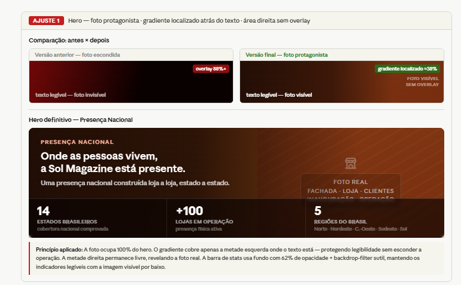 | 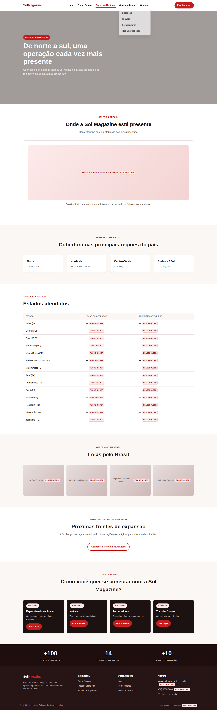 |

---

## 1. HOME

| Wireframe homologado (Home Refinada v2) | Implementado |
|---|---|
| 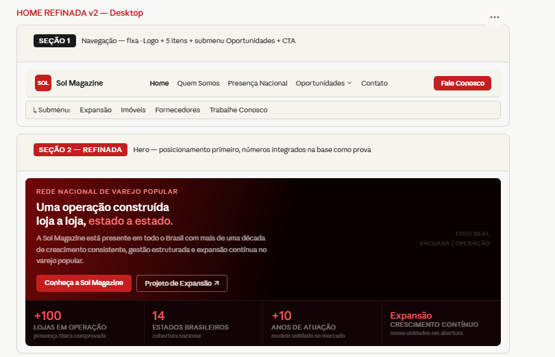 | 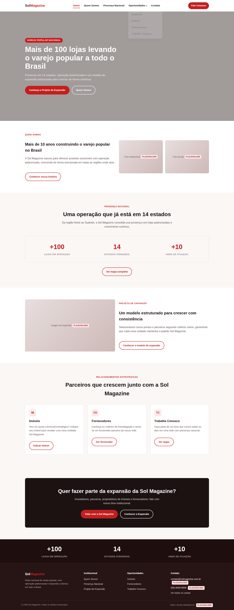 |
| 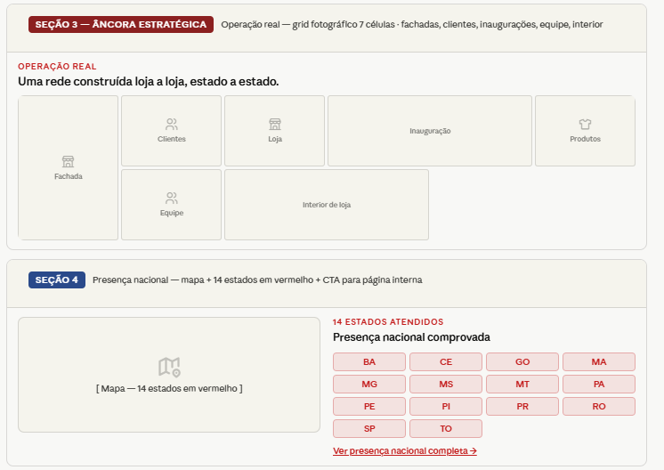 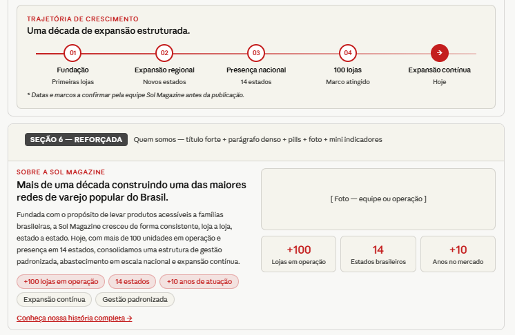 | |
| 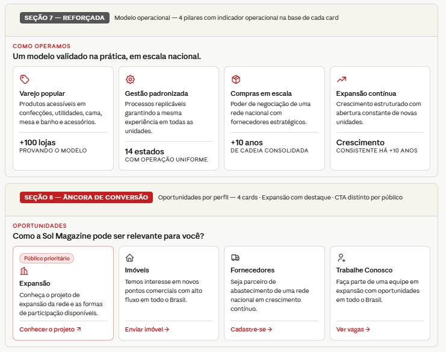 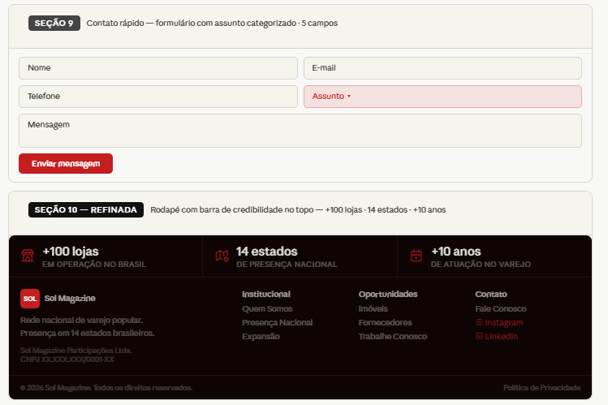 | |
| Mobile: 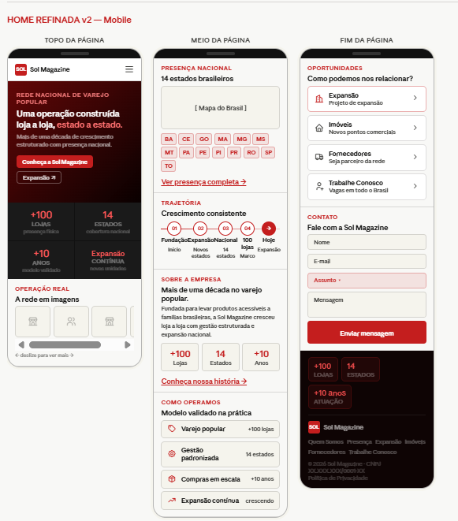 | 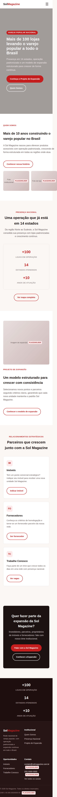 |

**Diferenças visuais**
- Hero implementado não traz overlay localizado (ver achado transversal).
- Wireframe usa fundo `#1a0808` para o corpo da página (mais escuro); implementação usa paleta padrão clara nas seções `section-alt`/`section-tinted` — variação de tom não verificada em detalhe pixel a pixel.

**Diferenças de conteúdo (estrutural)**
- **Seção "Operação Real" (galeria fotográfica de 7 células: Fachada, Clientes, Loja, Inauguração, Produtos, Equipe, Interior de loja)** — **ausente** na implementação. A Home implementada não tem nenhuma galeria fotográfica de prova operacional.
- **Seção "Presença Nacional" com mapa do Brasil + grid de 14 estados (BA, CE, GO, MA, MG, MS, MT, PA, PE, PI, PR, RO, SP, TO) + CTA "Ver presença completa"** — implementação tem apenas um `stats-bar` numérico, sem mapa nem grid de siglas de estado.
- **Seção "Trajetória de Crescimento" (timeline com marcos 01→04: Fundação, Expansão regional, Presença nacional, 100 lojas, Expansão contínua)** — **ausente** por completo na Home implementada.
- **Seção "Sobre a Sol Magazine" (Quem Somos reforçada)** no wireframe tem: parágrafo denso + 2 pills de destaque ("+100 lojas em operação", "14 estados", "+10 anos de atuação") + foto + mini indicadores em 3 colunas. A implementação tem uma versão mais simples, sem os pills e sem os mini indicadores na mesma seção.
- **Seção "Como Operamos" (4 pilares: Varejo popular, Gestão padronizada, Compras em escala, Expansão contínua, cada um com indicador de prova na base)** — **ausente** na Home implementada.
- **Seção "Oportunidades" final** no wireframe tem **4 cards** (Expansão — destacado como "Público prioritário" — + Imóveis + Fornecedores + Trabalhe Conosco) sob o título "Como a Sol Magazine pode ser relevante para você?". A implementação tem **3 cards** (Imóveis, Fornecedores, Trabalhe Conosco) sob o rótulo "Relacionamentos Estratégicos" — rótulo que, no wireframe, na verdade pertence à página **Quem Somos**, não à Home. O card de Expansão com destaque de prioridade não existe nesta seção da Home implementada (Expansão aparece em seção separada, sem o cartão de CTA por perfil).
- **Seção 9 — Formulário de contato rápido na própria Home** (5 campos: Nome, E-mail, Telefone, Assunto categorizado, Mensagem) — **ausente**. A Home implementada não tem formulário embutido, apenas CTAs que levam a outras páginas.

**Diferenças de navegação**
- Nenhuma divergente — menu, dropdown "Oportunidades" e CTA "Fale Conosco" do header conferem com o wireframe.

**Diferenças mobile**
- A versão mobile do wireframe replica as mesmas seções ausentes no desktop (galeria, mapa+14 estados, timeline, como operamos, formulário) — portanto, as mesmas lacunas se repetem no mobile.

**Classificação: DIVERGENTE**

---

## 2. QUEM SOMOS

| Wireframe homologado | Implementado |
|---|---|
| 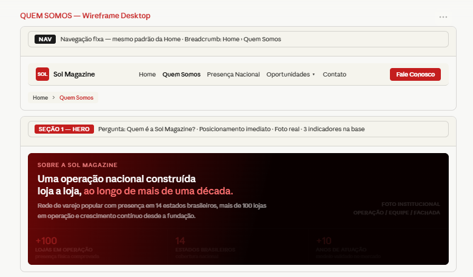 | 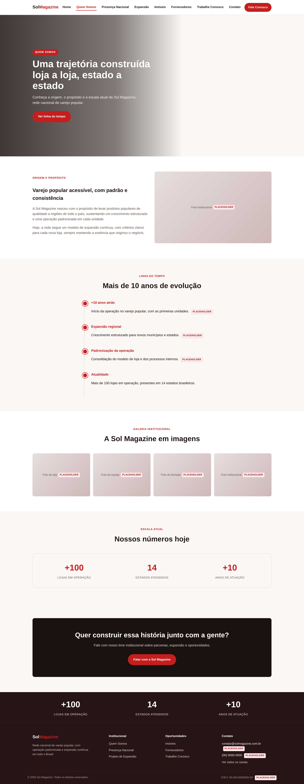 |
| 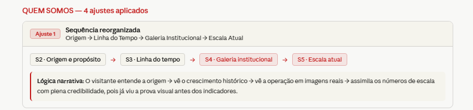 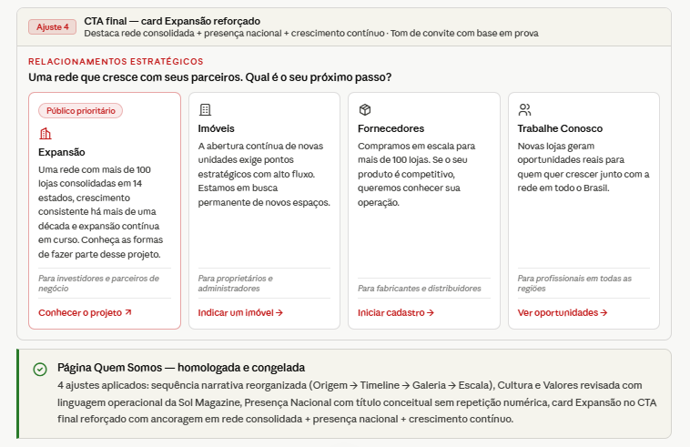 |  |

**Diferenças visuais**
- Wireframe inclui breadcrumb "Home > Quem Somos" sob o header — não implementado.
- Overlay do hero (ver achado transversal).

**Diferenças de conteúdo (estrutural)**
- Sequência de seções homologada (Ajuste 1): Origem e Propósito → Linha do Tempo → Galeria Institucional → Escala Atual. Esta sequência **está correta** na implementação (`quem-somos.html`).
- **Seção "Como Operamos" (4 pilares: Varejo popular, Gestão padronizada, Compras em escala, Expansão contínua)** — presente no wireframe, **ausente** na implementação.
- **Seção "Diferenciais Competitivos" (3 cards: Presença onde outros não chegam / Modelo validado em diversidade regional / Escala com gestão eficiente)** — **ausente** na implementação.
- **Seção "Presença Nacional" (Ajuste 3: mapa do Brasil + grid de 14 siglas de estado + texto "Presença real. Em todas as regiões do país.")** — **ausente** na implementação.
- **CTA final (Ajuste 4: "Relacionamentos Estratégicos", 4 cards — Expansão destacado como prioritário + Imóveis + Fornecedores + Trabalhe Conosco)** — a implementação tem apenas um CTA genérico de 1 botão ("Falar com a Sol Magazine"), sem os 4 cards por perfil.

**Diferenças de navegação**
- Nenhuma divergente no menu/header.

**Diferenças mobile**
- Mesmas lacunas estruturais do desktop se repetem (sem imagem de wireframe mobile específica disponível nesta pasta para conferência direta).

**Classificação: DIVERGENTE**

---

## 3. PRESENÇA NACIONAL

| Wireframe homologado (2º ajuste — congelado) | Implementado |
|---|---|
|  |  |
| 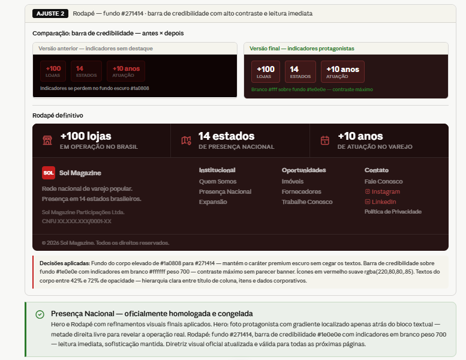 |  |

**Diferenças visuais**
- Hero: overlay deveria ser localizado atrás do texto, com metade direita da foto livre (ver achado transversal) — implementação usa overlay uniforme em toda a extensão.
- Rodapé (cor da barra de credibilidade `#1e0e0e`, fundo geral `#271414`): **confere** com o wireframe — ponto já corrigido (P1) e confirmado aqui.

**Diferenças de conteúdo**
- O rodapé definitivo do wireframe traz exatamente os mesmos números, links institucionais e redes sociais (Instagram, LinkedIn) presentes na implementação — aderente.
- Não foi possível, nesta rodada, reconfirmar visualmente as seções intermediárias da página (Mapa do Brasil interativo, Tabela por Estado, Galeria Contextual, "Onde Continuamos Crescendo") contra as imagens 1–14 do wireframe (primeira versão e primeiro ajuste) — esta auditoria revisou apenas as imagens 15–16 (segundo ajuste, hero e rodapé). **Pendência de verificação**, não confirmação de divergência.

**Diferenças de navegação / mobile**
- Nenhuma divergência identificada nos pontos revisados (hero e rodapé).

**Classificação: PARCIALMENTE ADERENTE** (divergência confirmada no overlay do hero; demais seções não totalmente reconfirmadas nesta rodada)

---

## 4. EXPANSÃO

| Wireframe homologado (v2 — ajustes 1–4) | Implementado |
|---|---|
| 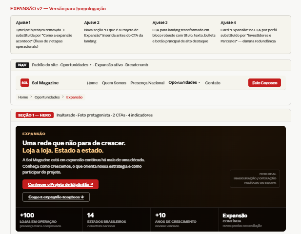 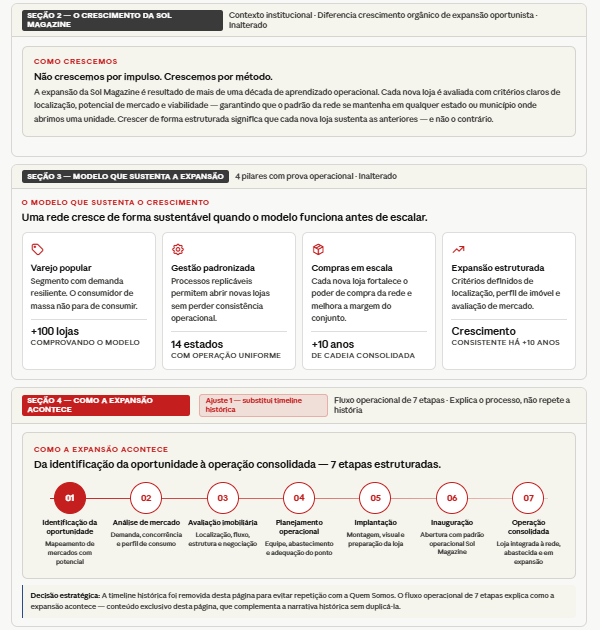 | 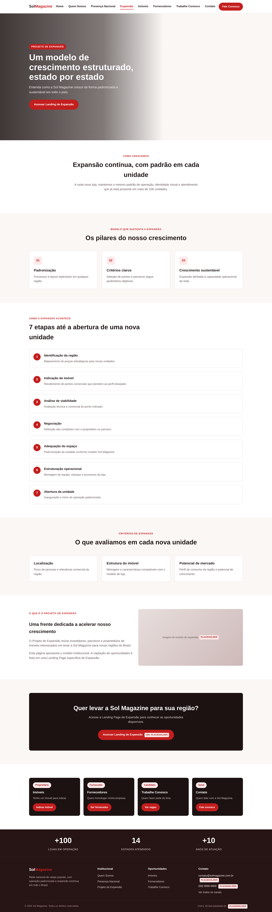 |
| 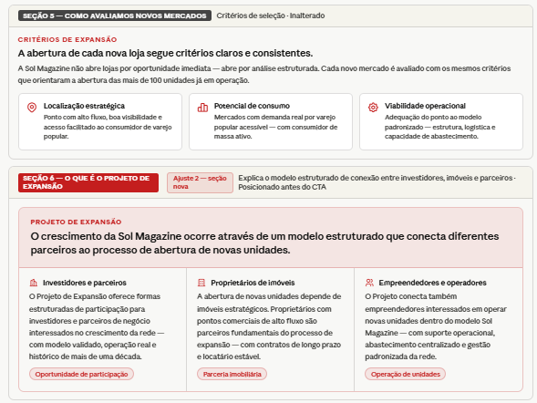 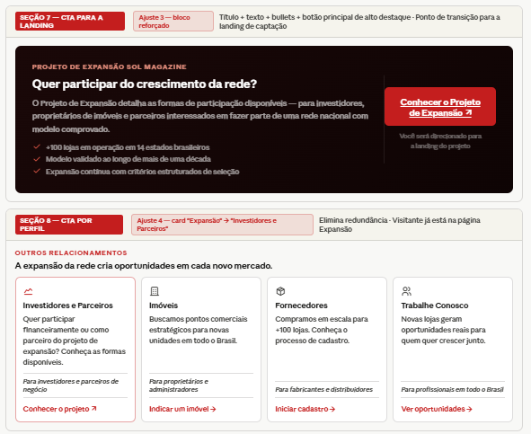 |  |

**Diferenças visuais**
- Overlay do hero (ver achado transversal).

**Diferenças de conteúdo**
- **"Como a Expansão Acontece" (7 etapas)** — quantidade de etapas (7) está correta, mas os **títulos e textos divergem significativamente** dos nomes homologados no wireframe:
  - Wireframe: Identificação da oportunidade → Análise de mercado → Avaliação imobiliária → Planejamento operacional → Implantação → Inauguração → Operação consolidada.
  - Implementado: Identificação da região → Indicação de imóvel → Análise de viabilidade → Negociação → Adequação do espaço → Estruturação operacional → Abertura e acompanhamento.
  - Isso confirma e amplia a ressalva já registrada em M2 ("sem acesso direto às imagens 6–12 nesta fase") — com acesso às imagens, fica confirmado que a reescrita de M2 **não reflete os nomes/conteúdo reais das 7 etapas homologadas**.
- **"Modelo que Sustenta a Expansão"**: wireframe tem **4 pilares** (Varejo popular, Gestão padronizada, Compras em escala, Expansão estruturada, cada um com indicador numérico). Implementação tem **3 cards genéricos** (Padronização, Critérios claros, Crescimento sustentável), sem os indicadores numéricos (+100, 14, +10 anos).
- **"Critérios de Expansão"**: wireframe nomeia 3 critérios como "Localização estratégica", "Potencial de consumo", "Viabilidade operacional". Implementação usa "Localização", "Estrutura do imóvel", "Potencial de mercado" — nomes e descrições diferentes.
- **"O que é o Projeto de Expansão"**: wireframe estrutura essa seção em **3 cards** (Investidores e parceiros / Proprietários de imóveis / Empreendedores e operadores). Implementação usa um bloco de texto em 2 colunas (texto + imagem), sem os 3 cards.
- **CTA final por perfil**: wireframe especifica os cards "Investidores e Parceiros" (não "Expansão") + Imóveis + Fornecedores + Trabalhe Conosco. Implementação usa "Expansão e Investimento" (perfil "Investidor") + Imóveis + Fornecedores + Trabalhe Conosco + Contato (5 cards, incluindo um card "Contato" que não está no wireframe).

**Diferenças de navegação**
- Links de CTA para a Landing de Expansão permanecem `href="#"` (placeholder já sinalizado e aceito como pendência de produção, não divergência de wireframe).

**Diferenças mobile**
- Mesmas divergências de conteúdo do desktop se repetem (estrutura responsiva em si preservada).

**Classificação: DIVERGENTE**

---

## 5. IMÓVEIS

| Wireframe homologado (oficialmente homologada e congelada) | Implementado |
|---|---|
| 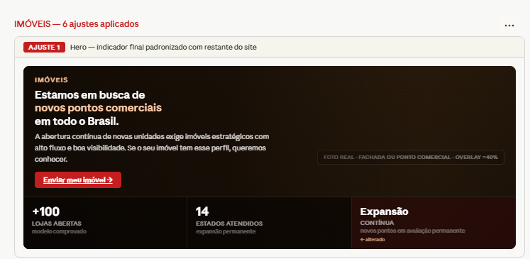 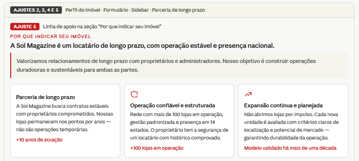 | 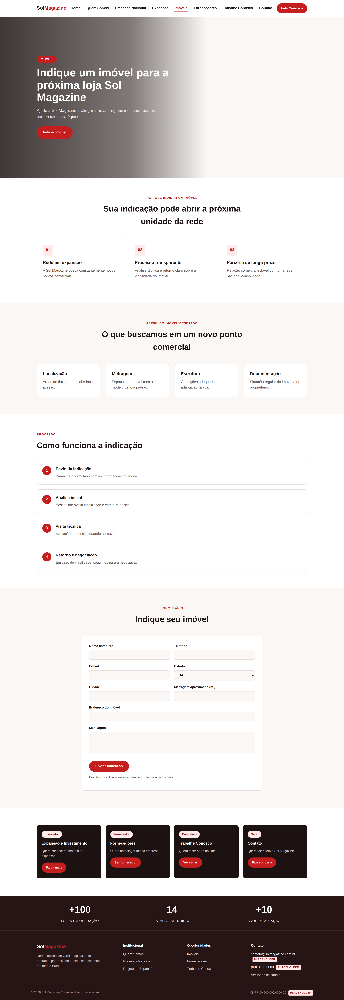 |
| 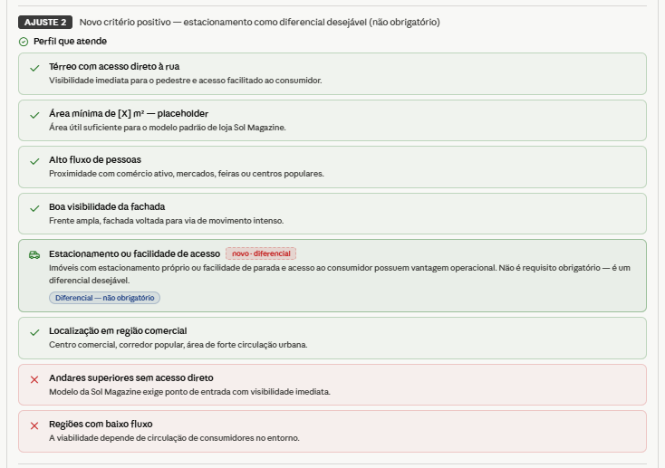 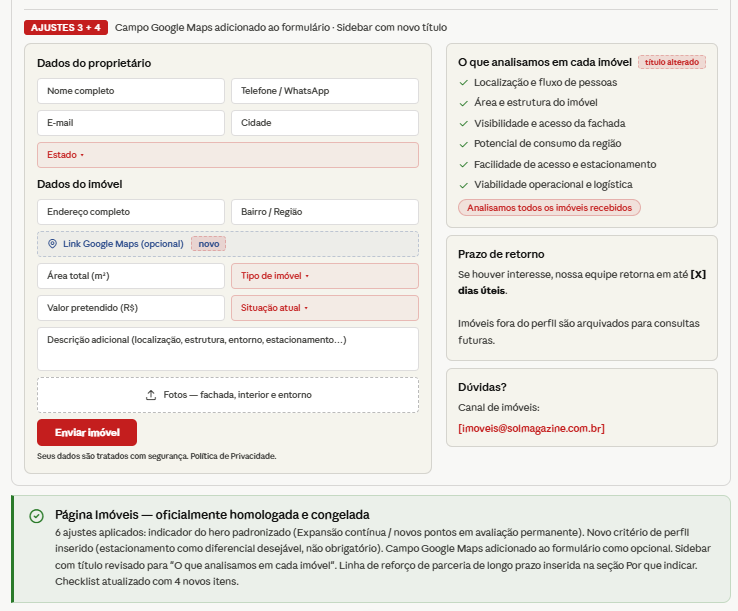 |  |

**Diferenças visuais**
- Overlay do hero (ver achado transversal).

**Diferenças de conteúdo**
- **Seção "Por que Indicar seu Imóvel"**: wireframe tem 3 cards nomeados "Parceria de longo prazo", "Operação confiável e estruturada", "Expansão contínua e planejada". Implementação usa "Rede em expansão", "Processo transparente", "Parceria de longo prazo" — apenas 1 dos 3 títulos coincide.
- **Seção "Perfil que atende" (checklist com 8 itens, formato ✓/✗: Térreo com acesso direto, Área mínima, Alto fluxo, Boa visibilidade, Estacionamento como diferencial, Localização em região comercial, Andares superiores sem acesso — não atende, Regiões com baixo fluxo — não atende)** — **ausente por completo**. A implementação tem apenas 4 cards genéricos ("Localização", "Metragem", "Estrutura", "Documentação"), sem o formato de checklist positivo/negativo nem os 8 critérios específicos.
- **Formulário**: campos homologados ausentes na implementação — **Bairro/Região**, **Tipo de imóvel** (select), **Valor pretendido (R$)**, **Situação atual** (select), **upload de fotos** (fachada, interior, entorno). Campos presentes e corretos: Nome completo, Telefone, E-mail, Estado, Cidade, Endereço, Link Google Maps (opcional), estacionamento como diferencial.
- **Sidebar do formulário ("O que analisamos em cada imóvel" + "Prazo de retorno" + "Dúvidas? canal de imóveis")** — **ausente por completo**. A implementação não tem nenhuma sidebar ao lado do formulário.

**Diferenças de navegação**
- Nenhuma divergência no menu/header.

**Diferenças mobile**
- Mesmas lacunas de formulário e ausência da seção "Perfil que atende" se repetem no mobile.

**Classificação: DIVERGENTE**

---

## 6. FORNECEDORES

| Wireframe homologado (oficialmente homologada e congelada) | Implementado |
|---|---|
| 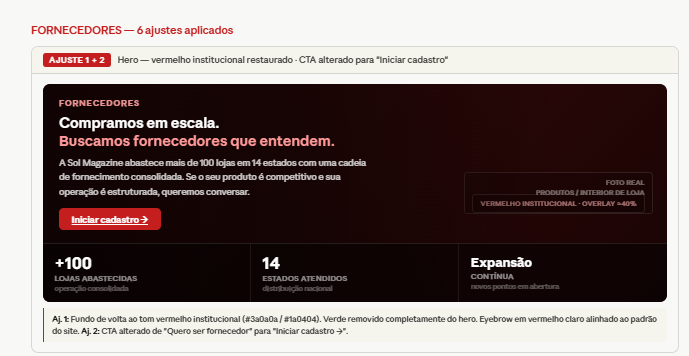 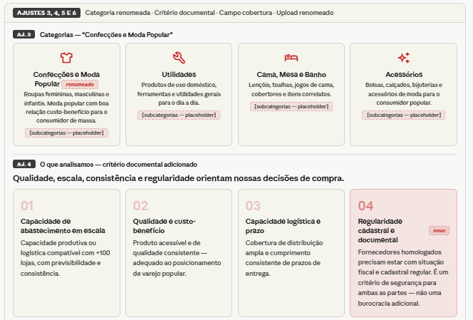 | 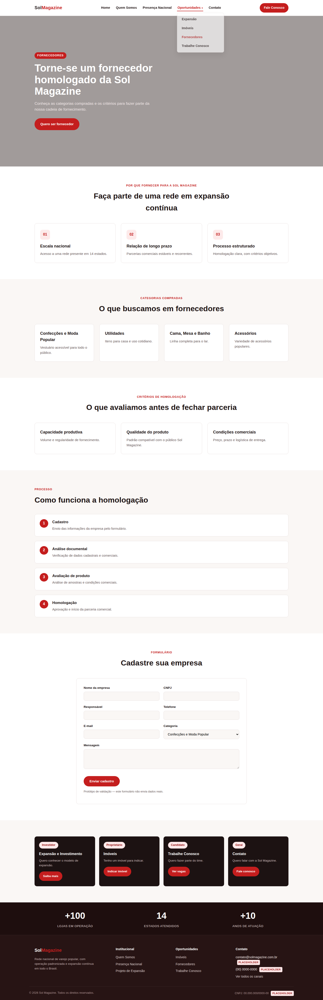 |
| 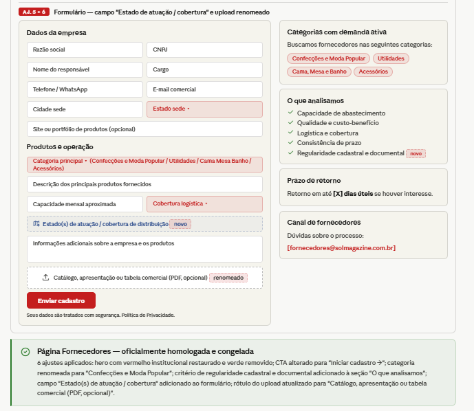 |  |

**Diferenças visuais**
- Overlay do hero (ver achado transversal).

**Diferenças de conteúdo**
- **Categorias** ("Confecções e Moda Popular", "Utilidades", "Cama, Mesa e Banho", "Acessórios") — **aderente**, nomes e quantidade conferem exatamente com o wireframe.
- **"O que analisamos" / "Critérios de Homologação"**: wireframe tem **4 critérios** (Capacidade de abastecimento em escala, Qualidade e custo-benefício, Capacidade logística e prazo, **Regularidade cadastral e documental** — marcado como "novo"). Implementação tem apenas **3 critérios** ("Capacidade produtiva", "Qualidade do produto", "Condições comerciais") — falta o 4º critério, justamente o que o Dossiê e o wireframe destacam como adição mais recente (regularidade cadastral/documental).
- **Formulário**: wireframe pede Razão social, Nome do responsável, **Cargo**, Telefone/WhatsApp, E-mail comercial, **Cidade sede**, **Estado sede**, **Site ou portfólio (opcional)**, Categoria principal, Descrição dos produtos, **Capacidade mensal aproximada**, **Estado(s) de atuação/cobertura logística**, **upload de catálogo/apresentação (opcional)**. Implementação tem apenas: Nome da empresa, CNPJ, Responsável, Telefone, E-mail, Categoria, Mensagem — faltam Cargo, Cidade/Estado sede, Site/portfólio, capacidade mensal, cobertura logística e upload de catálogo.
- **Sidebar ("Categorias com demanda ativa" + "O que analisamos" + "Prazo de retorno" + "Canal de fornecedores")** — **ausente por completo** na implementação.

**Diferenças de navegação**
- Nenhuma divergência no menu/header.

**Diferenças mobile**
- Mesmas lacunas de formulário e sidebar se repetem no mobile.

**Classificação: DIVERGENTE**

---

## 7. TRABALHE CONOSCO

| Wireframe homologado (oficialmente homologada e congelada) | Implementado |
|---|---|
| 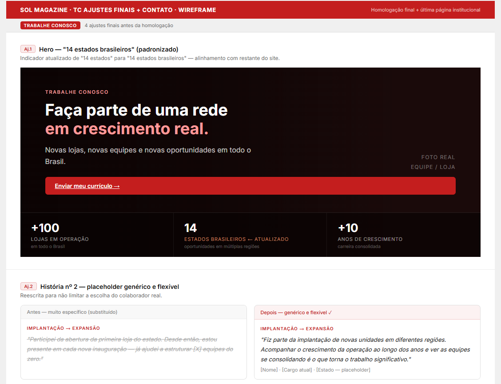 | 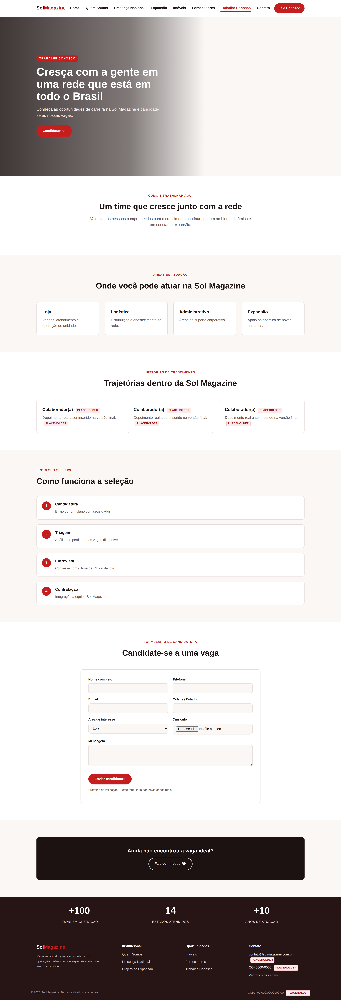 |
| 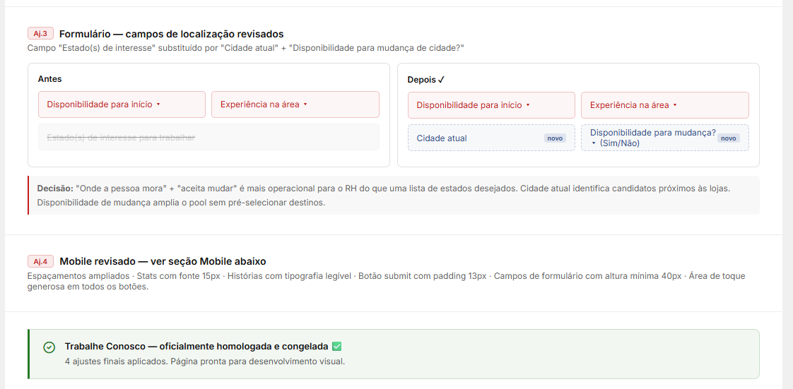 |  |

**Diferenças visuais**
- Overlay do hero (ver achado transversal).

**Diferenças de conteúdo**
- **Indicador "14 estados brasileiros" no hero** — **confere** com o wireframe (correção M4 confirmada visualmente).
- **História nº2 genérica e flexível** — **confere** com o wireframe (correção P2 confirmada visualmente).
- **Formulário**: o wireframe especifica o campo **"Experiência na área"** como um **select/dropdown**, não como caixa de texto livre. A implementação criou o campo "Experiência" como **textarea de texto livre**, com rótulo abreviado ("Experiência" em vez de "Experiência na área"). Divergência de tipo de campo e de rótulo.
- Campo "Disponibilidade para mudança?" do wireframe é descrito como pergunta direta (Sim/Não) — a implementação usa "Disponibilidade para Mudança" como select Sim/Não, o que está alinhado em essência, apenas com rótulo levemente diferente.
- Ordem dos campos no wireframe ("Depois"): Disponibilidade para início, Experiência na área, Cidade atual, Disponibilidade para mudança. A implementação não necessariamente segue esta mesma ordem (a ser confirmada em revisão de detalhe, divergência menor).

**Diferenças de navegação**
- Nenhuma divergência no menu/header.

**Diferenças mobile**
- Wireframe define ajustes específicos de mobile (Ajuste 4: espaçamentos ampliados, stats com fonte 15px, botão submit com padding 13px, campos com altura mínima 40px) — não verificado em detalhe de medida exata nesta rodada (necessitaria inspeção de CSS computado, fora do escopo de uma auditoria puramente visual).

**Classificação: PARCIALMENTE ADERENTE**

---

## 8. CONTATO

| Wireframe homologado (versão final, 6 ajustes) | Implementado |
|---|---|
| 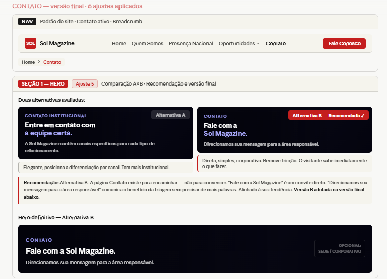 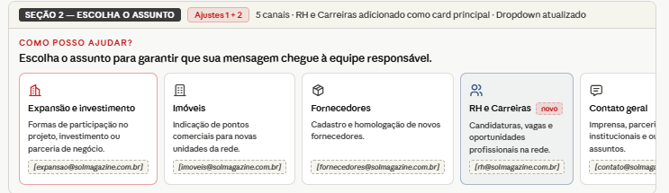 | 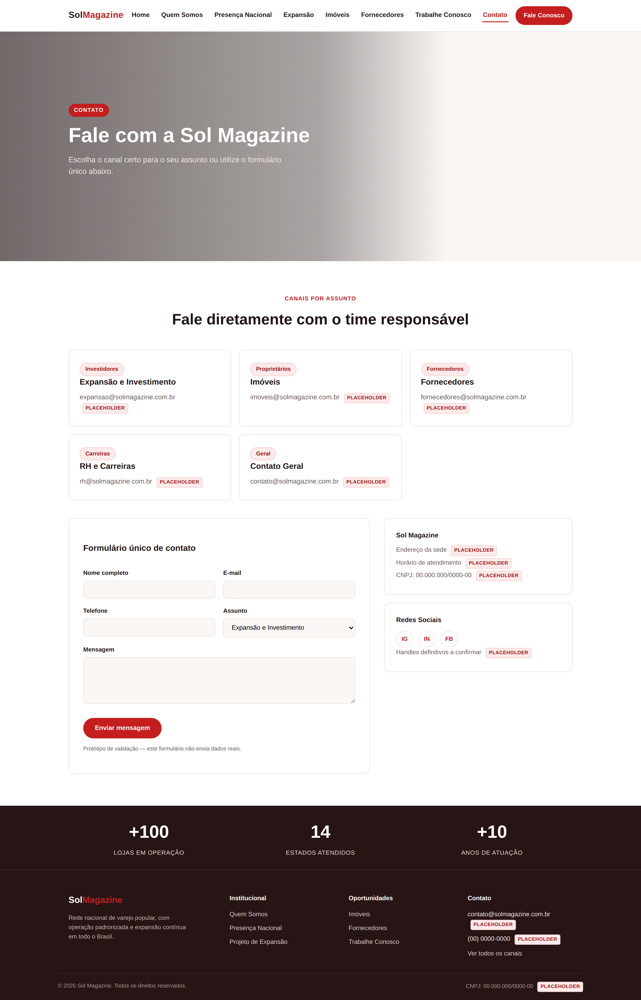 |
| 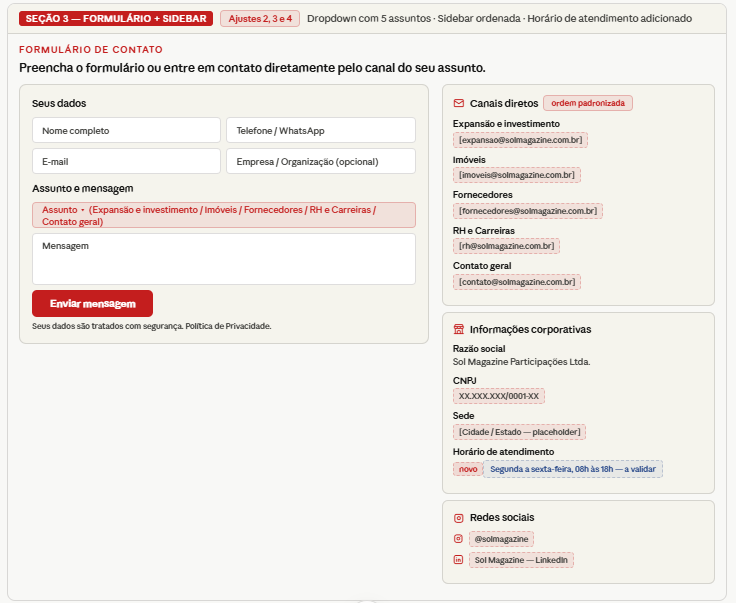 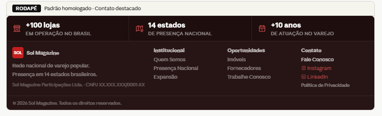 |  |

**Diferenças visuais**
- Overlay do hero (ver achado transversal).

**Diferenças de conteúdo**
- **Hero Alternativa B** ("Fale com a Sol Magazine." / "Direcionamos sua mensagem para a área responsável.") — **confere exatamente** com o wireframe (correção C5 confirmada visualmente como a versão recomendada e adotada).
- **5 canais por assunto** (Expansão e investimento, Imóveis, Fornecedores, RH e Carreiras, Contato geral) com e-mails correspondentes — **confere** com o wireframe.
- **Formulário**: wireframe inclui o campo **"Empresa / Organização (opcional)"**, que está **ausente** na implementação (campos implementados: Nome completo, E-mail, Telefone, Assunto, Mensagem — faltando apenas este campo).
- **Sidebar "Informações Corporativas"**: wireframe lista Razão social, CNPJ, **Sede (Cidade/Estado)**, Horário de atendimento. Implementação tem Razão social, Horário de atendimento, CNPJ — **falta o campo "Sede"**.
- **Redes sociais**: wireframe mantém Instagram e LinkedIn — **confere** com a implementação (remoção do Facebook em P4 confirmada como correta).
- Dois arquivos de imagem soltos na pasta de wireframes (`1 - Contato_V2.png` e `2 - Contato - ajustes.png`) mostram, na realidade, conteúdo da página **Trabalhe Conosco**, não da página Contato — aparentam ser arquivos arquivados/mal nomeados dentro da pasta `08-contato`, sem relação com o conteúdo real desta página. Não foram usados como referência por inconsistência de conteúdo; a versão usada como base foi a sequência de imagens do `.docx` (`image5` a `image10`), que é internamente consistente e confirmada pelo texto "Contato — versão final pronta para homologação".

**Diferenças de navegação**
- Nenhuma divergência no menu/header.

**Diferenças mobile**
- Mesmas duas lacunas (campo "Empresa/Organização" e "Sede" na sidebar) se repetem no mobile, conforme o wireframe mobile revisado (Ajuste 6).

**Classificação: PARCIALMENTE ADERENTE**

---

## Resumo de Classificação

| Página | Classificação |
|---|---|
| Home | **Divergente** |
| Quem Somos | **Divergente** |
| Presença Nacional | Parcialmente aderente |
| Expansão | **Divergente** |
| Imóveis | **Divergente** |
| Fornecedores | **Divergente** |
| Trabalhe Conosco | Parcialmente aderente |
| Contato | Parcialmente aderente |
| **Transversal — Overlay do hero (8 páginas)** | **Divergente** |

## Observação metodológica importante

As auditorias anteriores (`AUDITORIA_DE_ADERENCIA_AOS_WIREFRAMES.md`, `NOVA_MATRIZ_DE_ADERENCIA.md`) declararam **0 divergências pendentes** porque foram conduzidas **sem acesso direto às imagens dos wireframes homologados**, apoiando-se apenas no texto descritivo do Dossiê Oficial. Esta auditoria visual, feita com as imagens reais, identificou um volume substancial de seções, campos de formulário e conteúdos homologados que **não foram percebidos** nas rodadas anteriores — a maior parte deles concentrada em seções inteiras ausentes (galerias, timelines, checklists, sidebars de formulário) e em campos de formulário não implementados, além da divergência transversal do overlay do hero.

Nenhuma alteração de código foi realizada nesta etapa. Este relatório é exclusivamente de identificação de divergências, para decisão do usuário sobre quais correções autorizar a seguir.
